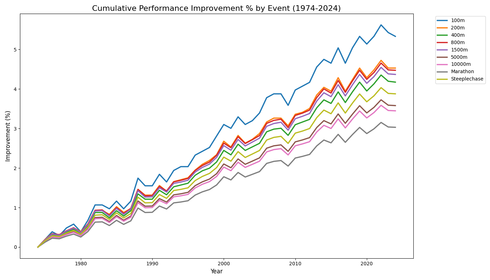
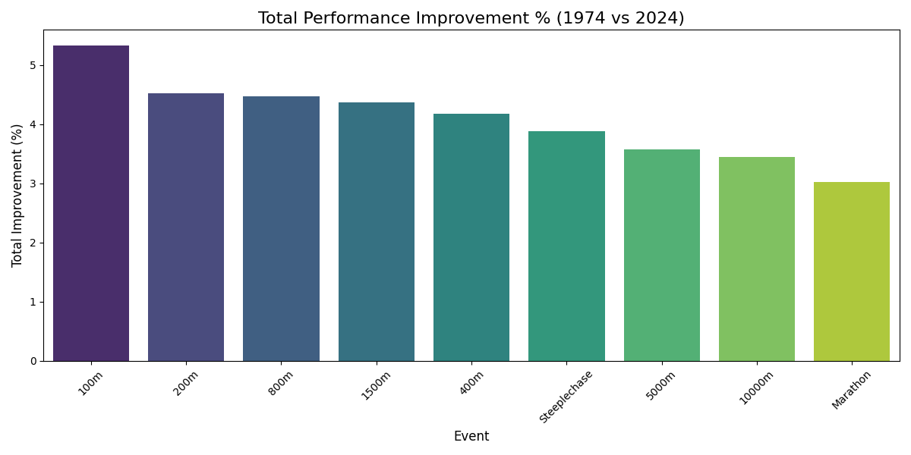

# Trackflation

Analyze historical World Athletics top times and project future world records using **Rolling Window Conformal Prediction**.

## Features
- **Historical Scraper**: Collects top track times since 1974.
- **Trend Analysis**: Quantifies the rate of improvement ("inflation") per event.
- **Conformal Prediction**: Provides statistically sound uncertainty intervals for future performance limits.
- **Future Projections**: Estimates WRs for the next 20+ years using Prophet + CP.

## Cross-Event Improvement Analysis

We compare the rate of "Trackflation" across different disciplines. 

### Relative Improvement % (1974-2024)


### Total Improvement % (Bar Chart)


The analysis shows that longer distance events (Marathon, 10000m) tend to see a higher total percentage improvement compared to short sprints (100m, 200m). This highlights that while absolute time gains in sprints are small, they represent significant athletic barriers, whereas distance running has seen more substantial relative "inflation" due to pacing, nutrition, and shoe technology.

## Causal Inference: The "Shoe Effect"

We conducted a multi-method causal study to isolate the impact of carbon-plated technology (post-2017) on elite performance.

### Key Evidence:
1. **Difference-in-Differences (DiD)**: Comparing Top 20 Marathoners vs 100m sprinters shows a statistically significant divergence starting in 2017, with distance running gaining an "excess" **~1.0% to 1.5% lead** over natural athletic trends.
2. **Interrupted Time Series (ITS)**: Analyzed the structural break in marathon times at 2017. The model detects a significant **immediate level shift** and an acceleration in the rate of improvement after the Vaporfly launch.
3. **Synthetic Control Comparison**: Created a "Synthetic Marathon" counterfactual by weighting sprint trends. The "Performance Wedge" (the gap between actual and synthetic marathon times) represents the quantifiable causal contribution of equipment innovation.

Detailed causal methodology, residual distributions, and counterfactual plots are available in the [Advanced Causal Analysis Notebook](notebooks/did_shoe_analysis.ipynb).

## Advanced Analytical Insights

### 1. Uncertainty & Monte Carlo (Probability Clouds)
To account for biological uncertainty, we ran **Monte Carlo simulations** sampling the "physiological ceiling" from a distribution.
- **Finding**: Our 2046 projection for the 100m is not a single number but a probability cloud centered at **9.50s**, with a 95% confidence spread between **9.46s and 9.54s**.
- See: [Monte Carlo Ceiling Notebook](notebooks/monte_carlo_ceiling.ipynb).

### 2. Record-Breaking Probability (Hazard Model)
Using **Survival Analysis**, we modeled the "Hazard Rate" (risk of falling) for World Records.
- **The "Shoe Era" Risk**: A record set in the current era has a **3x higher hazard rate** (probability of being broken in any given year) than records set in the pre-carbon era.
- **Longevity Decay**: The probability of a record standing for more than 10 years has dropped significantly as technological innovation accelerates.
- See: [Record Hazard Model Notebook](notebooks/record_hazard_model.ipynb).

## Cumulative Analysis (1974-2046)

The table below shows historical best times, real World Records as of June 2026, and our AI-driven projections for the next 20 years.

| Event        | 2000       | 2010       | Current (2026)   | 20-yr Prediction (2046)   |
|:-------------|:-----------|:-----------|:-----------------|:--------------------------|
| 100m         | 9.85       | 9.72       | 9.58             | 9.37                      |
| 200m         | 19.75      | 19.52      | 19.19            | 18.67                     |
| 400m         | 43.72      | 43.36      | 43.03            | 42.58                     |
| 800m         | 1:43.24    | 1:42.30    | 1:40.91          | 1:38.73                   |
| 1500m        | 3:30.97    | 3:28.90    | 3:26.00          | 3:21.32                   |
| 5000m        | 13:01.11   | 12:51.25   | 12:35.36         | 12:12.30                  |
| 10000m       | 26:59.74   | 26:41.06   | 26:11.00         | 25:27.24                  |
| Marathon     | 2:04:08.53 | 2:02:24.78 | 1:59:30.00       | 1:55:27.55                |
| Steeplechase | 8:06.17    | 8:00.46    | 7:52.11          | 7:38.86                   |

*Note: 2026 data reflects actual current World Records; 2046 is the median projection (yhat) using Rolling Window Conformal Prediction.*

## Visualizations

Detailed analysis notebooks with plots are available for each event:
- [100m Analysis](notebooks/analysis.ipynb)
- [200m Analysis](notebooks/200-metres_analysis.ipynb)
- [400m Analysis](notebooks/400-metres_analysis.ipynb)
- [800m Analysis](notebooks/800-metres_analysis.ipynb)
- [1500m Analysis](notebooks/1500-metres_analysis.ipynb)
- [5000m Analysis](notebooks/5000-metres_analysis.ipynb)
- [10000m Analysis](notebooks/10000-metres_analysis.ipynb)
- [Marathon Analysis](notebooks/marathon_analysis.ipynb)
- [Steeplechase Analysis](notebooks/3000-metres-steeplechase_analysis.ipynb)

## Setup

This project uses **Poetry** for dependency management and reproducibility.

1.  **Install Poetry**: Follow the instructions at [python-poetry.org](https://python-poetry.org/docs/#installation).
2.  **Install Dependencies**:
    ```bash
    poetry install
    ```
3.  **Run the Analysis**:
    ```bash
    poetry run python -m src.main --event "100-metres"
    ```
4.  **Open Notebooks**:
    ```bash
    poetry run jupyter notebook
    ```

## Methodology: Conformal Prediction
Unlike standard time-series models that assume normal error distributions, we use **Rolling Window Conformal Prediction**. This method calculates the historical residuals of the Prophet model and uses their quantiles to scale the prediction intervals. This ensures that the intervals are robust to the "spiky" nature of track improvements.
