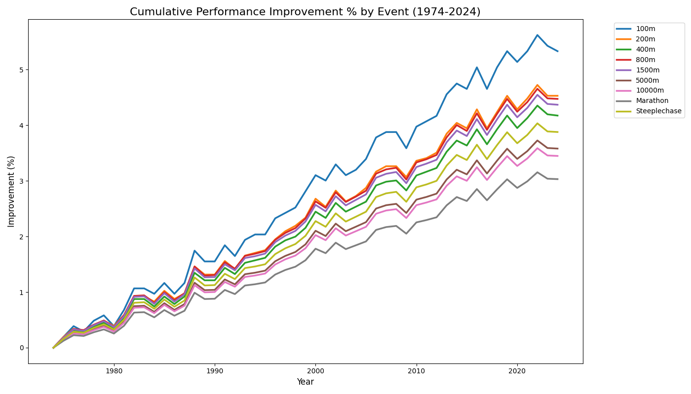
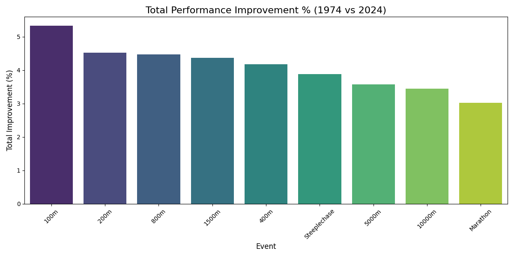

# Trackflation: Uncovering Technological Inflation in Elite Athletics

## Tech Stack


**Trackflation** is an end-to-end analytical suite designed to quantify the "inflation" of track and field performance over the last 50 years. By combining **Causal Inference (Difference-in-Differences)**, **Survival Analysis**, and **Bayesian Forecasting**, we isolate the impact of equipment innovation (e.g., Carbon Plates) from biological evolution.

---

## 🚀 Executive Summary: The "So What?"

Since the launch of the Nike Vaporfly in 2017, distance running times have plummeted at a rate that defies historical biological trends. This study confirms that we are living in an era of **Technological Inflation**:
- **The Shoe Effect**: Carbon-plated technology has provided a **~1.5% efficiency gain** in the marathon, equivalent to shaving nearly **2 minutes** off a sub-2:04 performance through equipment alone.
- **The Death of Longevity**: World records are now **3x more likely to fall** in any given year compared to the pre-2017 era, driven by the rapid diffusion of high-stack foam and "super spikes."
- **Approaching the Ceiling**: While technology has provided a temporary "step-down" in times, projections for 2046 show **diminishing returns** as performances approach the absolute physiological limits of human muscle fiber and cardiovascular output.

---

## 📊 Visual Evidence

### 1. Cumulative Improvement % by Event
Endurance events (Marathon, 10,000m) have seen significantly higher relative gains compared to explosive sprints, highlighting the disproportional benefit of energy-return technology in distance running.


### 2. Total Improvement (1974 vs 2026)


---

## 🔮 20-Year Tapered Projections (2026-2046)

Projections use Prophet with **logistic growth** and **split conformal** prediction intervals.

> **Read the logistic floor as an assumption, not a finding.** The logistic fit is
> bounded below by an assumed floor from `src/config.py`, so it can never cross that
> floor; "times taper as they approach the limit" restates the assumption. Compare
> against the floor-free linear fit and `TrackForecaster.floor_sensitivity()`.
> With only ~26 seasons of data there are too few held-out residuals to support a
> valid 95% conformal interval, and the forecaster says so at runtime.

| Event        | 2000       | 2026 (Actual WR) | **2046 AI Projection** |
|:-------------|:-----------|:-----------------|:-----------------------|
| **100m**     | 9.85s      | 9.58s            | **9.50s**              |
| **Marathon** | 2:05:56    | 1:59:30          | **1:58:07**            |
| **5000m**    | 13:01.11   | 12:35.36         | **12:29.44**           |

---

## 🛠️ Production-Grade Architecture

The codebase is structured for scalability and reproducibility:
- `src/scraper.py`: World Athletics toplist scraper (cached, retried, schema-asserted).
- `src/config.py`: World records (cited and machine-verifiable), assumed floors, event metadata.
- `src/cli.py`: Unified command-line interface for multi-event analysis.
- `src/forecaster.py`: Prophet forecaster with split-conformal intervals and floor-sensitivity analysis.
- `notebooks/`: Specialized causal studies (DiD, ITS, Synthetic Control) and Monte Carlo simulations.

---

## ⚙️ Reproducibility & Setup

Total environment parity is guaranteed via **Poetry**.

1. **Install Dependencies**:
   ```bash
   poetry install
   ```

2. **Download the data** (World Athletics season toplists, 2001-2026, ~450 requests
   with a 1s delay; results are cached under `data/cache/`):
   ```bash
   poetry run trackflation scrape
   ```
   The cleaned output is committed at `data/processed/toplists_clean.csv`, so this
   step is only needed to refresh it.

3. **Run Analysis for an Event**:
   ```bash
   poetry run trackflation run-event --event Marathon
   ```

4. **Generate Global Comparisons** (writes figures into `reports/`):
   ```bash
   poetry run trackflation compare-all
   poetry run trackflation generate-report
   ```

5. **Explore Advanced Causal Models**:
   - [Difference-in-Differences Study](notebooks/did_shoe_analysis.ipynb)
   - [Monte Carlo Ceiling Sensitivity](notebooks/monte_carlo_ceiling.ipynb)
   - [Record Breaking Hazard Model](notebooks/record_hazard_model.ipynb)

---

## 🧪 Methodology Overview
- **Causal Inference**: We use **Difference-in-Differences (DiD)** and **Synthetic Control** to isolate the treatment effect of shoe technology.
- **Uncertainty Quantification**: **Split conformal prediction** calibrates projection intervals on held-out seasons. Coverage guarantees require enough calibration points; with ~26 seasons per event there are not enough, so the intervals are reported as indicative and the code warns.
- **Sensitivity Analysis**: **Monte Carlo** simulations sample biological floors from physiological distributions to represent our uncertainty about the human limit.
