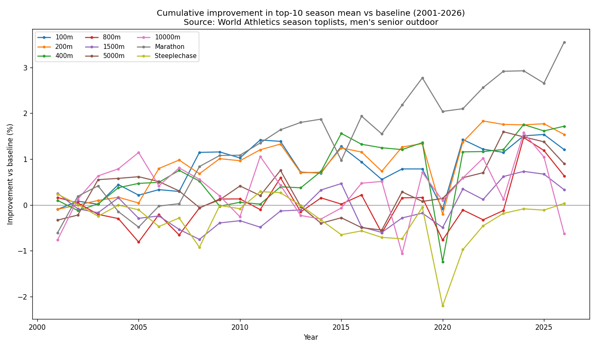
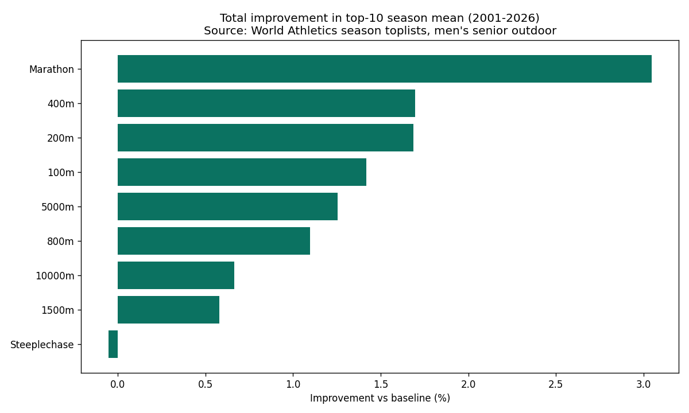

# Trackflation: Measuring Technological Inflation in Elite Athletics

## Tech Stack


**Trackflation** asks whether elite distance-running times have improved faster than
biology alone would explain since carbon-plated "super shoes" arrived in 2017, and
what the record progression looks like going forward.

**Data:** 23,296 marks — every World Athletics season toplist entry for nine men's
senior outdoor events, 2001–2026, scraped from
[worldathletics.org](https://worldathletics.org/records/toplists) and committed at
`data/processed/toplists_clean.csv`. World Athletics toplists do not exist before
2001, so 2001 is the real start of the observable record here, not 1974.

---

## 📌 Executive Summary

- **The marathon really is the outlier.** Its top-10 season mean improved **3.05%**
  between the 2001–2003 and 2024–2026 windows. No track event exceeds 1.7%, and the
  steeplechase went marginally *backwards* (−0.05%). That gap is the central
  empirical fact in this repo.
- **The difference-in-differences estimate is ~1.3%, and it does not survive its own
  placebo test.** Marathon vs sprint controls, pre/post 2017, gives −1.24% to −1.46%
  depending on the control set (p < 0.001). But running the identical specification
  with a *fake* 2010 intervention on pre-2017 data only still returns −0.83%
  (p = 0.001). Parallel trends is violated: the marathon was already diverging from
  the sprints before super shoes existed. **An unknown share of that 1.3% is
  pre-existing trend, so this project does not have a clean causal shoe effect.**
  The event study below shows a drift beginning around 2013, not a discontinuity
  at 2017.
- **"Records are 3× more likely to fall" is not supported and is dropped.** On this
  data the naive version of that statistic points the other way — 25.2% of
  event-seasons set an in-window best during 2002–2016 vs 7.8% during 2017–2026.
  That comparison is itself biased (a running maximum mechanically gets harder to
  beat as the window lengthens), which is exactly why no claim is made from it.
  The marathon is the one event that keeps producing bests late in the window
  (2018, 2022, 2023, 2026).
- **Projections are dominated by an assumption, not by the data.** See the caveat
  under the projection table.

### What changed, and why the earlier numbers here were worthless

Every headline number in previous versions of this README was recovered from
constants the code injected into itself: `cli.py` synthesised marks from a
hard-coded `base` and `rate` per event, and `did_shoe_analysis.ipynb` called
`generate_causal_data(..., shoe_effect=85.0)` and then "found" an ~1.5% shoe
effect. The estimator was being tested on its own inputs. Those numbers were
presented here as evidence about the real world; they were evidence about nothing.
The pipeline now runs on scraped data, and the numbers above are what it actually
produces — including the parts that undercut the original thesis.

---

## 📊 Cumulative improvement, 2001–2026

Top-10 season mean, anchored to the mean of the first three seasons and compared
against the mean of the last three (a single season's minimum is far too noisy to
anchor a percentage against).





| Event        | Seasons   | Baseline top-10 mean | Recent top-10 mean | Improvement % | World record |
|:-------------|:----------|:---------------------|:-------------------|--------------:|:-------------|
| 100m         | 2001-2026 | 9.97                 | 9.83               |          1.42 | 9.58         |
| 200m         | 2001-2026 | 20.08                | 19.74              |          1.69 | 19.19        |
| 400m         | 2001-2026 | 44.65                | 43.89              |          1.70 | 43.03        |
| 800m         | 2001-2026 | 1:43.31              | 1:42.18            |          1.10 | 1:40.91      |
| 1500m        | 2001-2026 | 3:30.30              | 3:29.08            |          0.58 | 3:26.00      |
| 5000m        | 2001-2026 | 12:57.01             | 12:47.27           |          1.25 | 12:35.36     |
| 10000m       | 2001-2026 | 27:05.76             | 26:54.94           |          0.67 | 26:11.00     |
| **Marathon** | 2001-2026 | 2:06:43.73           | 2:02:52.17         |      **3.05** | 1:59:30.00   |
| Steeplechase | 2001-2026 | 8:04.58              | 8:04.85            |         -0.05 | 7:52.11      |

Regenerate with `poetry run trackflation generate-report` (writes `reports/`).

### Marathon minus sprint controls, by season

Normalised top-10 mean, marathon less the mean of 100m/200m/400m. If super shoes
caused a discrete 2017 break, the drop should begin at 2017. It does not.

| 2001 | 2005 | 2010 | 2013 | 2016 | 2017 | 2020 | 2023 | 2026 |
|-----:|-----:|-----:|-----:|-----:|-----:|-----:|-----:|-----:|
| +0.42% | +0.57% | −0.56% | −1.37% | −0.96% | −0.86% | −2.71% | −1.71% | −2.23% |

---

## 🔮 Projections to 2046

Prophet, fitted to each event's season best, with **logistic growth** and **split
conformal** intervals.

> **The floor is an input, not a finding.** The logistic fit is bounded below by an
> assumed floor in `src/config.py`, so it *cannot* cross that floor — "performances
> taper as they approach the physiological limit" restates the assumption rather
> than testing it. The floor-free linear fit is shown alongside for exactly this
> reason, and the gap between the two columns is how much of the projection is the
> assumption talking. Use `TrackForecaster.floor_sensitivity()` to vary it.
>
> **The intervals do not carry a coverage guarantee.** Split conformal at α = 0.05
> needs at least 19 calibration residuals; 26 annual observations cannot supply
> them. The code emits a warning and falls back to the largest held-out residual.
> Read the intervals as indicative width, nothing more.

| Event    | 2001 top-10 | 2026 top-10 | 2026 best | **2046 (logistic, assumed floor)** | 2046 (linear, no floor) | Assumed floor |
|:---------|:------------|:------------|:----------|:-----------------------------------|:------------------------|:--------------|
| 100m     | 9.98        | 9.85        | 9.79      | **9.72**                           | 9.75                    | 9.45          |
| Marathon | 2:07:29.80  | 2:02:13.60  | 1:59:30   | **1:58:45**                        | 1:56:29                 | 1:57:00       |
| 5000m    | 12:59.58    | 12:50.02    | 12:47.62  | **12:40.93**                       | 12:31.91                | 12:25.00      |

For the marathon the two fits disagree by 2m15s over 20 years — the assumption is
doing more work than the data. Regenerate with
`poetry run trackflation run-event --event Marathon`.

---

## 🛠️ Architecture

- `src/scraper.py`: World Athletics toplist scraper — per-(event, year) disk cache,
  retries with backoff, `raise_for_status`, columns resolved by header name, and a
  schema assertion that fails loudly rather than returning an empty frame.
- `src/config.py`: World records (each cited inline and re-checkable), *assumed*
  biological floors, event metadata and discipline groups. Men's events only.
- `src/data_cleaner.py`: mark parsing, the +2.0 m/s wind rule applied to sprints
  only, and deduplication on a real result key.
- `src/analysis_engine.py`: season statistics, robust (median/MAD) anomaly
  detection, trend fits with their limitations documented.
- `src/forecaster.py`: Prophet with split-conformal intervals and floor-sensitivity
  analysis.
- `src/cli.py`: `scrape`, `run-event`, `compare-all`, `generate-report`.
- `notebooks/event_analysis.ipynb`: one parameterised notebook covering all nine
  events. It replaces nine near-identical 490 KB copies that differed only in two
  literals; set `EVENT` in the parameter cell or drive it with papermill.
- `notebooks/did_shoe_analysis.ipynb`: the DiD, event study and placebo test above.
- `notebooks/record_hazard_model.ipynb`: why the "3x" claim is withdrawn.
- `notebooks/monte_carlo_ceiling.ipynb`: floor-assumption sensitivity analysis.
- `scripts/verify_world_records.py`: re-checks `src/config.py` against the live
  all-time toplists.

---

## ⚙️ Reproducibility & Setup

```bash
poetry install
```

The analysis input is committed, so you can go straight to:

```bash
poetry run trackflation run-event --event Marathon
poetry run trackflation compare-all
poetry run trackflation generate-report
```

To refresh the data from World Athletics (~450 requests, 1s apart, cached under
`data/cache/`):

```bash
poetry run trackflation scrape
```

Notebooks import the installed package, so run them under the Poetry environment
(`poetry run jupyter lab`) rather than relying on a `sys.path` hack.

---

## ✅ Tests & CI

```bash
poetry run pytest
```

80 offline tests cover mark/time parsing (including the HH:MM:SS branch and a
`seconds_to_str` round trip), the wind and dedup rules, the robust anomaly
detector, the forecast horizon, and the toplist HTML parser against fixture
markup. No test touches the network. GitHub Actions runs them on Python 3.11, 3.12
and 3.13, and a second job executes every notebook top to bottom against the
committed data, so a notebook that cannot run in order fails the build
(`.github/workflows/ci.yml`).

`scripts/verify_world_records.py` re-checks `src/config.py` against the live World
Athletics all-time toplists. It is deliberately outside the test run, since it
needs the network. All nine records verify as of 2026-08-11.

---

## 🧪 Methodology & known limitations

- **Difference-in-differences** compares the marathon against sprint events before
  and after 2017. Its identifying assumption (parallel pre-trends) **fails the
  placebo test reported above**, so the estimate is an upper bound on any shoe
  effect, not a causal effect.
- **Toplists are not a random sample.** They are the top ~100 marks per season, so
  field depth, meet scheduling, prize money and drug-testing regimes all move the
  series independently of technology. None of that is controlled for.
- **Annual extremes are not Gaussian.** Season bests and top-10 means are
  extreme-value statistics with heteroskedastic errors, so OLS p-values on these
  series are descriptive only. `AnalysisEngine.depth_adjusted_rate` at least
  controls for field size.
- **Men's events only.** Nothing here applies to women's events.
- **No shoe adoption data.** The "treatment" is a calendar year, not observed
  footwear. Athlete-level or race-level shoe data would be a large improvement.
